> HTTP와 웹 브라우저의 캐시 검증과 조건부 요청에 대한 자세한 내용은 [#HTTP (4-2) - HTTP 캐시 검증 & 조건부 요청][http-4-2] 게시글을 참고

## 프록시(Proxy) 캐시

프록시는 클라이언트와 본 서버를 중계하는 중간에 위치한 서버 대리자로서, 클라이언트의 요청을 대신 받고 본 서버에 해당 요청을 대신 전달해주는 역할을 한다.

이 프록시를 <ins>캐시 서버</ins>로서 이용할 수 있는데, 예를 들어서 한국에 있는 클라이언트에서 이미지가 필요한 상황이고, 해당 이미지의 본 서버가 미국에 있다고 가정해보자.

한국 서버에서 미국 서버까지 직접 접근하여 이미지를 가져오는데는 약 0.5초가 걸린다고 하면, 한국에 위치한 컴퓨터들은 모두 0.5초 가량을 기다려야 해당 이미지를 받을 수 있게 된다.

![image_31][image_31]

위와 같은 현상을 해결하기 위해 프록시 캐시를 도입하여 사용한다고 보면 된다.

한국에 프록시 캐시 서버를 따로 두고, 최초의 요청에만 미국 서버까지 가서 이미지 리소스를 받아오고 프록시 캐시 서버에 저장한다.

그러면 한국의 클라이언트는 리소스를 가져올 때 프록시 캐시 서버로부터 가져오면 된다.

![image_32][image_32]

특히 여러 사람들이 찾는 자료일수록 이미 캐시에 등록되어있을 가능성이 크기에 효과적으로 빠른 속도로 자료를 가져올 수 있다.

유튜브에서 고용량의 영상을 빠르게 볼 수 있는 이유도 이에 해당한다.

즉, 같은 국내에 캐시된 데이터가 있는 덕분에 본 서버에 접근하는 것보다 훨씬 빠른 속도에 자료를 가져올 수 있다는 것이다.

![image_33][image_33]

참고로 클라이언트에서 사용되고 저장되는 캐시를 <ins class="red">private 캐시</ins>라고 하며, 프록시 캐시 서버의 캐시를 <ins class="blue">public 캐시</ins>라고 한다.

웹 브라우저 캐시와 프록시 서버 캐시가 분리되어 운용되는 만큼, 위에서 설명한 Cache-Control HTTP 헤더도 <ins>프록시 전용으로 캐시를 설정</ins>해야 한다.

### 프록시 캐시 헤더

![image_34][image_34]
_CDN에서는 1년 동안 캐시되지만, 브라우저에서는 매번 재검증 요청을 보내도록 설정_

- `Cache-Control: private`
  : 응답이 해당 사용자만을 위한 것으로 private 캐시에 저장해야 한다. (default)

- `Cache-Control: public`
  : 응답이 public 캐시에 저장되어야 한다.

- `Cache-Control: s-maxage`
  : 프록시 캐시에만 적용되는 `max-age`

- `Age: 60`
  : HTTP 헤더로써, 오리진 서버에서 응답 프록시 캐시 내에 머문 시간이다.(초 단위)

## HTTP 캐시 무효화

<ins>캐시 무효화(Cache Busting)</ins>는 말 그대로 웹 브라우저의 캐시를 완전히 제거해 버리는 것을 말한다.

이러한 기술이 필요한 이유는 웹 브라우저들이 `GET` 요청을 받을 경우에 별도의 캐시 헤더 없이도 <ins class="red">자기 마음대로 최적화를 한다고 임의로 캐싱을 해 버리기 때문</ins>이다.

또한 리소스의 캐시 유효 기간을 길게 설정해버리는 바람에 리소스의 업데이트가 필요할 경우, 캐시 저장소의 복사본을 갱신해줘야 하는데, 기본적으로 브라우저는 캐시 유효 기간이 끝나야 캐시 유효성 검증을 서버에게 요청하기 때문에 어떠한 방법이 없다.

이런 문제를 해결하기 위해 캐시 무효화 전략을 사용한다고 보면 된다.

```mermaid
---
title: Cache-Control의 흐름도
---
flowchart TD
  A(응답을 캐싱 할 것인가?) -->|<ins class="red">NO</ins>| B(no-store<br>캐싱 안함)
  A -->|<ins class="blue">YES</ins>| C(캐시 사용 전에 <ins>캐시 유효성 검증</ins>을 할 것인가?)
  C -->|<ins class="red">NO</ins>| D(프록시 캐시를 사용하는가?)
  C -->|<ins class="blue">YES</ins>| E(no-cache<br><ins>매번 서버에서 캐시 유효성 검증</ins>을 하고 캐시 사용)
  E --> D
  D -->|<ins class="blue">YES</ins>| F(public<br><ins>프록시 캐시에 저장</ins>)
  D -->|<ins class="red">NO</ins>| G(private<br><ins>클라이언트 캐시에 저장</ins>)
  G --> H(캐시 유효 기간을 설정하는가?)
  F --> H
  H --> I(max-age= ∙∙∙)
  I --> J(Add ETag Header)
```



### 캐시 무효화 헤더

만약 캐시를 사용해서는 안되는 페이지가 존재한다면, 다음과 같이 Cache-Control 헤더에 파라미터들을 설정해줘야 한다.

```http
HTTP/1.1 200 OK
Cache-Control: no-cache, no-store, must-revalidate
Pragma: no-cache
```

- `Cache-Control: no-cache`
  : 데이터는 캐시해도 되지만, 항상 본 서버에 검증하고 사용해야 한다는 의미로, `max-age=0`과 동일한 뜻이다.
  : 즉, 서버로부터 304 응답을 받아야 캐시에서 가져온다는 의미로, 비록 네트워크 트래픽이 발생하지만 헤더 메시지만 응답받기 때문에 네트워크 다운로드량은 적다.
  : `no-cache`라는 명칭 때문에 캐시를 사용하지 않는다고 생각할 수 있지만, 이 단어의 의미는 본래 캐시 유효 기간이 남아있으면 무조건 캐시 저장소를 조회하지만, 그러지 말고 무조건 서버에 검증을 받으라는 의미이다.

- `Cache-Control: no-store`
  : 데이터에 민감한 정보가 있기에 저장하면 안된다는 의미이다.
  : 메모리에서 사용하고 최대한 빠르게 삭제한다.

- `Cache-Control: must-revalidate`
  : 캐시 만료 후 최초 조회 시, 본 서버에 검증해야 할 때 설정한다.
  : 본 서버에 접근 실패 시, 반드시 504(Gateway Timeout) 오류가 발생하도록 해야 한다.
  : 만일 캐시 유효 시간 내에 있다면, 캐시를 사용한다.

- `Pragma: no-cache`
  : HTTP/1.0 하위 호환용으로 사용한다.

{: .prompt-tip}

> 간혹, 몇몇 웹 페이지에서는 캐시 무효화 우회 로직으로 Cache-Control 헤더에 `max-age=0`으로 설정해 놓는다.
>
> 캐시 유효 시간을 `0`으로 설정해 놓으면, 매번 리소스를 요청할 때마다 서버에 재검증 요청을 보내게 된다.
>
> 하지만, 몇몇 일부 모바일 브라우저의 경우 네트워크 요청을 아끼고 사용자에게 빠른 웹 경험을 제공하기 위해 웹 브라우저를 껐다 켜기 전까지 리소스가 만료되지 않도록 하는 경우도 존재한다.
>
> 따라서 `max-age=0`을 사용하기 보다는 좀 더 명확한 `no-store` 파라미터를 사용하기를 권장한다.

## 참고 사이트

> [Inpa Dev - 🌐 웹 브라우저의 Cache 전략 & 헤더 다루기][ref_site_1]
>
> [Semantics - HTTP (7) - 캐시와 조건부 요청 (Last-Modified / ETag)][ref_site_2]

<!-- 이미지 -->

[image_1]: {{page.image-path}}/http-4_1.png
[image_2]: {{page.image-path}}/http-4_2.png
[image_3]: {{page.image-path}}/http-4_3.png
[image_4]: {{page.image-path}}/http-4_4.png
[image_5]: {{page.image-path}}/http-4_5.png
[image_6]: {{page.image-path}}/http-4_6.png
[image_7]: {{page.image-path}}/http-4_7.png
[image_8]: {{page.image-path}}/http-4_8.png
[image_9]: {{page.image-path}}/http-4_9.png
[image_10]: {{page.image-path}}/http-4_10.png
[image_11_dark]: {{page.image-path}}/http-4_11_dark.png
[image_12_dark]: {{page.image-path}}/http-4_12_dark.png
[image_11_light]: {{page.image-path}}/http-4_11_light.png
[image_12_light]: {{page.image-path}}/http-4_12_light.png
[image_13]: {{page.image-path}}/http-4_13.png
[image_14]: {{page.image-path}}/http-4_14.png
[image_15]: {{page.image-path}}/http-4_15.png
[image_16]: {{page.image-path}}/http-4_16.png
[image_17]: {{page.image-path}}/http-4_17.png
[image_18]: {{page.image-path}}/http-4_18.png
[image_19]: {{page.image-path}}/http-4_19.png
[image_20]: {{page.image-path}}/http-4_20.png
[image_21]: {{page.image-path}}/http-4_21.png
[image_22]: {{page.image-path}}/http-4_22.png
[image_23]: {{page.image-path}}/http-4_23.png
[image_23_dark]: {{page.image-path}}/http-4_23_dark.png
[image_23_light]: {{page.image-path}}/http-4_23_light.png
[image_24]: {{page.image-path}}/http-4_24.png
[image_25]: {{page.image-path}}/http-4_25.png
[image_26]: {{page.image-path}}/http-4_26.png
[image_27]: {{page.image-path}}/http-4_27.png
[image_28]: {{page.image-path}}/http-4_28.png
[image_29]: {{page.image-path}}/http-4_29.png
[image_30]: {{page.image-path}}/http-4_30.png
[image_31]: {{page.image-path}}/http-4_31.png
[image_32]: {{page.image-path}}/http-4_32.png
[image_33]: {{page.image-path}}/http-4_33.png
[image_34]: {{page.image-path}}/http-4_34.png
[image_35]: {{page.image-path}}/http-4_35.png
[image_36]: {{page.image-path}}/http-4_36.png
[image_37]: {{page.image-path}}/http-4_37.png
[image_38]: {{page.image-path}}/http-4_38.png
[image_39]: {{page.image-path}}/http-4_39.png

<!-- 블로그 게시글 -->

[http-4-2]: {{site.url}}/posts/http-4-2

<!-- 참고 사이트 -->

[ref_site_1]: https://inpa.tistory.com/entry/HTTP-%F0%9F%8C%90-%EC%9B%B9-%EB%B8%8C%EB%9D%BC%EC%9A%B0%EC%A0%80%EC%9D%98-%EC%BA%90%EC%8B%9C-%EC%A0%84%EB%9E%B5-Cache-Headers-%EB%8B%A4%EB%A3%A8%EA%B8%B0
[ref_site_2]: https://velog.io/@neity16/HTTP-7-%EC%BA%90%EC%8B%9C%EC%99%80-%EC%A1%B0%EA%B1%B4%EB%B6%80-%EC%9A%94%EC%B2%AD-Last-Modified-ETag
