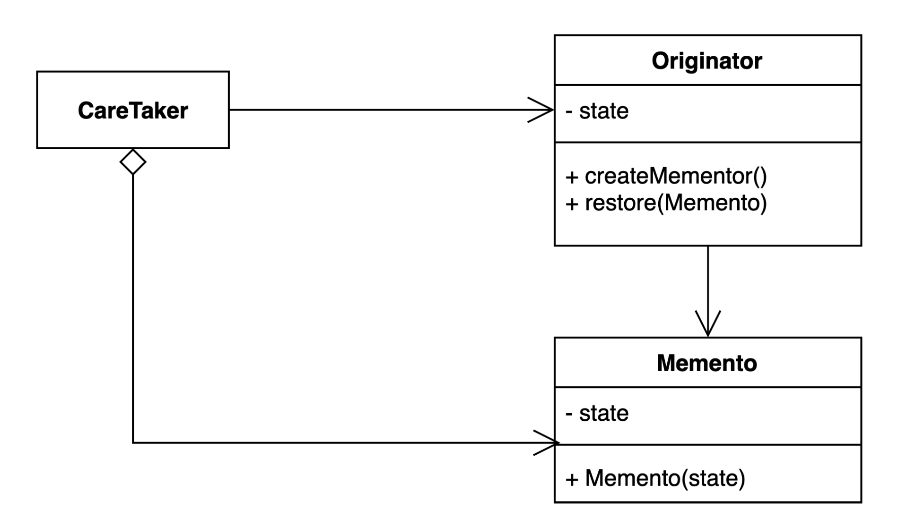

## Memento Pattern

### 배포된 예제 사이트

- [memento-example 사이트](https://memento-example.vercel.app/)

### 개념

- 객체의 상태 정보를 가지는 클래스를 따로 생성하여 객체의 상태를 저장하거나, 이전 상태로 복원할 수 있게 해주는 패턴

- 원하는 시점의 상태 복원이 가능

### 패턴 구조

- `Originator`

  - 내부 상태를 보유하고 있는 일부 객체

  - `CareTaker`는 `Originator`에 대해 무언가를 하지만, 변경에 대한 실행 취소를 하기를 원함

- `CareTaker`

  - 먼저 `Originator`에게 `Memento` 객체를 요청

  - 그 뒤, 예정된 일련의 명령을 수행

  - 명령 이전의 상태로 되돌리기 위해 `Memento` 객체를 `Originator`에 반환

- `Memento`

  - 객체 자신은 불투명 자료형

    - `CareTaker`가 변경할 수 없거나 변경해서는 안됨

### 참고한 출처 사이트

> [Refactoring GURU](https://refactoring.guru/ko/design-patterns)
>
> [Inpa Dev Blog (디자인 패턴)](https://inpa.tistory.com/category/%EB%94%94%EC%9E%90%EC%9D%B8%20%ED%8C%A8%ED%84%B4)
