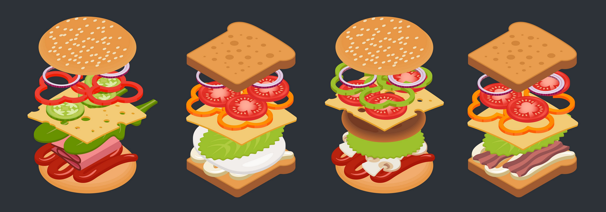

## Builder Pattern

### 개념

- 복잡한 객체의 생성 과정과 표현 방법을 분리하여 다양한 구성의 인스턴스를 만드는 생성 패턴

- 생성자에 들어갈 매개 변수를 메서드로 하나하나 받아들이고 마지막에 통합 빌드해서 객체를 생성하는 방식

- 예를 들면 수제 햄버거와 같은 느낌

  

### 패턴 구조

### 참고한 출처 사이트

> [Refactoring GURU](https://refactoring.guru/ko/design-patterns)
>
> [Inpa Dev Blog (디자인 패턴)](https://inpa.tistory.com/category/%EB%94%94%EC%9E%90%EC%9D%B8%20%ED%8C%A8%ED%84%B4)
