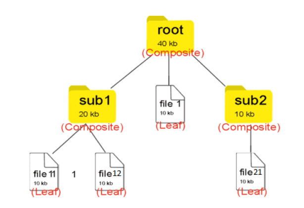

## Composite Pattern

### 개념

- 복합 객체(`Composite`)와 단일 객체(`Leaf`)를 동일한 컴포넌트로 취급하여, 클라이언트에게 이 둘을 구분하지 않고 동일한 인터페이스를 사용하도록 하는 구조 패턴

  - 정리하자면, 복합체 패턴은 그릇과 내용물을 동일시해서 재귀적인 구조를 만들기 위한 디자인 패턴이라고 말할 수 있음

- 복합체 패턴은 전체-부분의 관계를 갖는 객체들 사이의 관계를 트리 계층 구조로 정의해야 할 때 유용함

  - 윈도우나 리눅스의 **_파일 시스템 구조_**를 떠올려보면 쉽게 이해할 수 있음

  - 디렉토리 개념의 예시 이미지

    

    - 폴더(디렉토리) 안에는 파일이 들어있을 수도 있고, 파일을 담은 또 다른 폴더도 들어있을 수 있음

    - 이를 복합적으로 담을 수 있다고 해서 `Composite` 객체라고 불림

    - 반면, 파일은 단일 객체이기 때문에 이를 `Leaf` 객체라고 불림

      - 즉, `Leaf`는 자식이 없음

### 패턴 구조

- `Component`

  - `Leaf`와 `Composite`를 묶는 공통적인 상위 인터페이스

- `Composite`

  - 복합 객체로서, `Leaf` 역할이나 `Composite` 역할을 넣어 관리하는 역할

  - `Component` 구현체들을 내부 리스트로 관리함

  - `add`와 `remove` 메소드는 내부 리스트에 단일 / 복합 객체를 저장

  - `Component` 인터페이스의 구현 메서드인 `operation`은 복합 객체에서 호출되면 재귀하여, 추가 단일 객체를 저장한 하위 복합 객체를 순회하게 됨

- `Leaf`

  - 단일 객체로서 단순하게 내용물을 표시하는 역할

  - `Component` 인터페이스의 구현 메서드인 `operation`은 단일 객체에서 호출되면 적절한 값만 반환

- `Client`

  - 클라이언트는 `Component`를 참조하여 단일 / 복합 객체를 하나의 객체로서 다룸

### 참고한 출처 사이트

> [Refactoring GURU](https://refactoring.guru/ko/design-patterns)
>
> [Inpa Dev Blog (디자인 패턴)](https://inpa.tistory.com/category/%EB%94%94%EC%9E%90%EC%9D%B8%20%ED%8C%A8%ED%84%B4)
