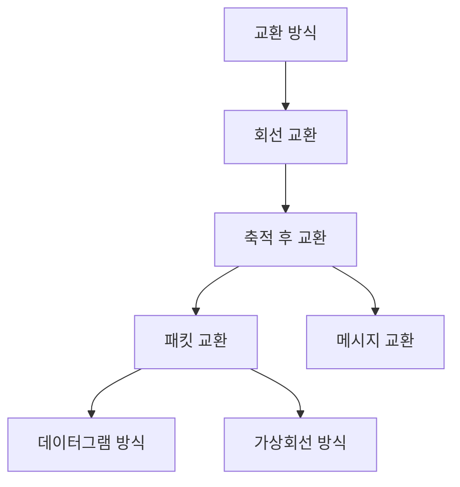
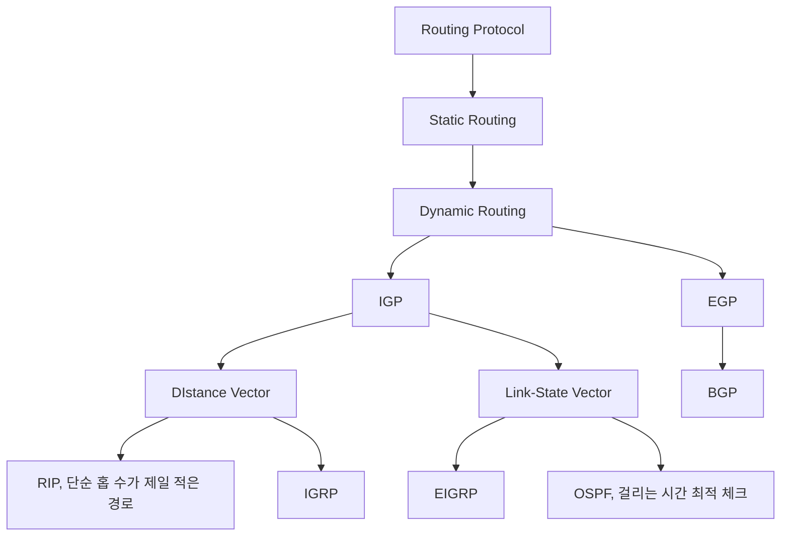
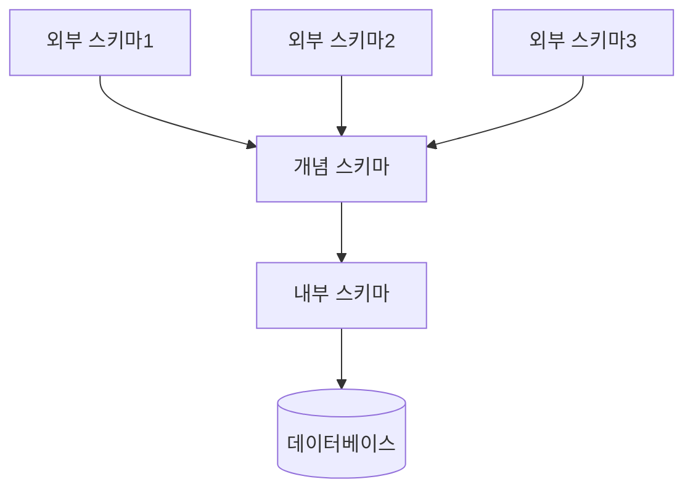

## 실기 기출 이론 정리

---

#### 트랜잭션

> [#트랜잭션](https://hyungjinhan.github.io/posts/eip-8/#%ED%8A%B8%EB%9E%9C%EC%9E%AD%EC%85%98)

- ACID
	- 원자성 (Atomicity) : 전부 되거나, 전부 안되거나
	- 일관성 (Consistency) : 일관성 있어야 함
	- 독립성, 격리성 (Isolation) : 다른 트랜잭션이 영향 X
	- 영속성 (Durability) : 영구히 보전되어야 함
- COMMIT / ROLLBACK
	- 부분완료 (Partially Commited)

#### 정규화

- 이상 현상
	- 삽입 : 불필요한 것도 삽입
	- 삭제 : 연쇄적인(의도치 않은) 삭제
	- 갱신 : 정보의 모순이 생겨서 갱신
- 함수적 종속 : A(결정자) → B(종속자)
	- 완전
		- 주민번호 → 이름, 나이, 성별 등
	- 부분
	- 이행
		- X → Y / Y → Z 분리
- 정규형 단계 (도부이결다조)

	> [#데이터베이스 정규화 단계](https://hyungjinhan.github.io/posts/eip-10/#%EB%8D%B0%EC%9D%B4%ED%84%B0%EB%B2%A0%EC%9D%B4%EC%8A%A4-%EC%A0%95%EA%B7%9C%ED%99%94-%EB%8B%A8%EA%B3%84)

- 반정규화

	> [#반정규화의 주요 기법](https://hyungjinhan.github.io/posts/eip-8/#%EB%B0%98%EC%A0%95%EA%B7%9C%ED%99%94%EC%9D%98-%EC%A3%BC%EC%9A%94-%EA%B8%B0%EB%B2%95)

	- <ins>성능 향상이나 개발 및 운영의 편의성을 위해 의도적으로 중복을 허용</ins> ⭐
- 데이터베이스 설계 단계

	> [#DB 설계 절차](https://hyungjinhan.github.io/posts/eip-9/#db-%EC%84%A4%EA%B3%84-%EC%A0%88%EC%B0%A8)

#### 관계형 데이터베이스 관련 용어

- 릴레이션 (테이블) : 표 형태의 데이터 집합
	- 튜플(행)들의 집합
- 릴레이션 스키마 - 내포
	- 릴레이션의 이름과 릴레이션의 속성들의 집합
- 릴레이션 인스턴스 - 외연
	- 릴레이션에 어느 시점에 들어있는 튜플들의 집합
	- 시간의 흐름에 따라 계속 변하며 일반적으로 릴레이션에는 현재의 인스턴스만 저장
- 속성 (열, 필드, 컬럼) : 데이터 표현의 최소 단위
	- 테이블에서 열을 의미
- 튜플 (레코드) : 릴레이션을 구성하는 하나의 데이터
	- 테이블에서 행을 의미
	- 튜플은 릴레이션에서 같은 값을 가질 수 없음
- 도메인 : 속성이 가질 수 있는 값의 범위
	- 동일한 도메인이 여러 속성에서 사용될 수 있음
- 디그리 : 속성(열)의 개수
- 카디널리티 : 튜플(행)의 개수

#### 정보 보안 요소

> [#SW 개발 보안의 3대 요소](https://hyungjinhan.github.io/posts/eip-10/#sw-%EA%B0%9C%EB%B0%9C-%EB%B3%B4%EC%95%88%EC%9D%98-3%EB%8C%80-%EC%9A%94%EC%86%8C)

- 기밀성 : 정보의 암호화
- 무결성 : 인가된 사용자만 변경
- 가용성 : 언제든지 접근
- 인증 : 사용자 확인
- 부인방지 : 정보 전송 부인 방지
- AAA
	- 인증 (Authentication)
	- 권한 부여 (Authorization)
	- 계정 관리 (Accounting)

#### 블랙박스 테스트 기법

> [#블랙박스 테스트의 유형](https://hyungjinhan.github.io/posts/eip-9/#%EB%B8%94%EB%9E%99%EB%B0%95%EC%8A%A4-%ED%85%8C%EC%8A%A4%ED%8A%B8%EC%9D%98-%EC%9C%A0%ED%98%95)

#### 보안 솔루션

- VPN
	- 공중 네트워크를 사용해 전용 회선처럼 보안 통신을 제공하는 솔루션
- SIEM
	- 보안 경고의 실시간 분석, 빅데이터 기반 심측 분석
- WAF
	- <ins>웹 기반 공격(ex: SQL 삽입, XSS)을 방어하기 위한 방화벽</ins> ⭐
- 기타
	- IDS(탐지), IPS(탐지 + 차단 = 방지), DLP(데이터 유출 방지)
	- NAC(접근통제), FDS(이상 금융거래 탐지)

#### 결합도 & 응집도

1. 결합도 (Coupling) - 모듈의 연관성 정도, 결합도는 낮은게 좋음

	> [#결합도 유형](https://hyungjinhan.github.io/posts/eip-10/#%EA%B2%B0%ED%95%A9%EB%8F%84-%EC%9C%A0%ED%98%95)

	- 자료 결합도 (Data) : 값 전달
		- 가장 좋은 결합도
	- 스탬프 결합도 (Stamp) : 배열, 오브젝트 등 전달
	- 제어 결합도 (Control) : 제어 요소 전달
	- 외부 결합도 (External) : 외부에서 데이터 참조
	- 공통 결합도 (Common) : 전역변수 이용
	- 내용 결합도 (Content) : 다른 모듈의 변수/기능 이용
		- 가장 나쁜 결합도
2. 응집도 (Cohesion) - 응집도는 높은게 좋음

	> [#응집도 유형](https://hyungjinhan.github.io/posts/eip-10/#%EC%9D%91%EC%A7%91%EB%8F%84-%EC%9C%A0%ED%98%95)

	- 우연적 응집도 (Coincidental) : 연관 없는 경우
		- 가장 나쁜 응집도
	- 논리적 응집도 (Logical) : 유사한 성격
	- 시간적 응집도 (Temporal) : 특정 시간에 처리
	- 절차적 응집도 (Procedural) : 순차적으로 수행
	- 통신적 응집도 (Communication) : 동일한 입력과 출력을 사용
	- 순차적 응집도 (Sequential) : 출력값을 입력값으로 사용
	- 기능적 응집도 (Functional)  : 단일 목적 수행
		- 가장 좋은 응집도

#### UI 설계

- 설계 원칙

	> [#UI 설계 원칙](https://hyungjinhan.github.io/posts/eip-8/#ui-%EC%84%A4%EA%B3%84-%EC%9B%90%EC%B9%99)

- UI 유형
	- CLI : 키보드로 명령어를 입력
	- GUI : 그래픽과 텍스트 기반 인터페이스
	- NUI : 인간의 자연스러운 움직임

#### 형상관리

> [#형상관리의 절차](https://hyungjinhan.github.io/posts/eip-8/#%ED%98%95%EC%83%81%EA%B4%80%EB%A6%AC%EC%9D%98-%EC%A0%88%EC%B0%A8)

- 형상 관리 절차
	- 형상 식별 : 관리 항목 구분
	- <ins>형상 통제 : 변경 요청을 받아서 검토하고 승인하여 현재의 기준선에 반영</ins> ⭐
	- 형상 감사 : 계획에 따른 검토
	- 형상 기록 : 과정을 기록
- 형상 관리 도구
	- CVS, SVN, Git

#### 데이터 교환 방식





#### <ins>라우팅 프로토콜</ins> ⭐





#### 인터페이스

- EAI

	> [#EAI(Enterprise Application Integration)의 구축 유형](https://hyungjinhan.github.io/posts/eip-9/#eaienterprise-application-integration%EC%9D%98-%EA%B5%AC%EC%B6%95-%EC%9C%A0%ED%98%95)

	- 기업 내 다양한 플랫폼 및 애플리케이션을 연결하고 통합하는 솔루션
- 전송 데이터
	- JSON : 이름과 값의 쌍으로 데이터를 구성
	- XML : 데이터를 저장하고 전달하는 목적의 마크업 언어
	- YAML : 데이터 직렬화 언어
- 인터페이스 구현
	- AJAX
		- 비동기 방식으로 데이터를 교환할 수 있는 통신 기능
		- 페이지를 새로고침하지 않고 페이지 일부만을 변경
	- SOAP (Simple Object Access Protocol)
		- HTTP, HTTPS, SMTP 등을 통해 XML 기반 메시지를 교환하는 프로토콜
		- SOAP(메시지 교환 프로토콜), UDDI(업체 목록 등록), WSDL(세부사항 기술)
	- REST
		- HTTP URI를 통한 자원 식별과 HTTP Method를 통한 CRUD 작업을 구현하는 자원 기반의 구조

#### 스토리지

- 스토리지 종류
	- DAS
		- 물리적 스토리지
	- NAS
		- 네트워크를 통한 스토리지
	- SAN
		- 고속(사이버) 채널 네트워크를 통한 스토리지
- RAID

	> 저장장치 여러 개를 묶어 고용량, 고성능인 저장 장치 한 개와 같은 효과를 얻기 위해 개발된 기법

	- <ins>RAID-0 : 스트라이핑</ins> ⭐
	- <ins>RAID-1 : 미러링</ins> ⭐
	- <ins>RAID-2 : 해밍코드</ins> ⭐
	- <ins>RAID-3 : 한 디스크에 패리티 저장</ins> ⭐
	- RAID-4 : RAID-3과 유사, 블록 단위로 분산 저장
	- RAID-5 : 각 디스크에 패리티 포함
	- RAID-6 : 두 개의 패리티, 분산 저장

#### 3계층 스키마





#### DoS 공격

- 정상적인 서비스를 수행하지 못하도록 방해하는 공격
- 공격 유형
	- Smurf Attack : IP와 ICMP 프로토콜의 특성을 이용
	- Ping Of Death : 정상 크기 이상이 ICMP 패킷 전송
	- Land Attack : 출발지 IP와 목적지 IP가 동일한 패킷 전송
	- Teardrop Attack : 재조립 과정 방해
	- SYN Flooding : SYN 신호만 전송
	- UDP Flooding : 대량의 UDP 패킷을 전송
	- Ping Flooding : 대량의 ICMP Echo 요청 패킷 전송
	- DDoS 공격

#### 병행 제어

- 병행 제어를 하지 않았을 때의 문제점
	- 갱신 분실
	- 비완료 의존성
	- 모순성
	- 연쇄 복귀
- 병행 제어 기법
	- 로킹 (Locking)
	- 2단계 로킹 규약 (Two-Phase Locking Protocol)
	- 타임 스탬프 (Time Stamp)
	- 낙관적 병행 제어
	- 다중 버전 병행 제어

#### 회복 기법

- <ins>로그 기반 회복 기법</ins> ⭐
	- 지연 갱신 : REDO
	- 즉시 갱신 : REDO, UNDO
- 검사점 회복 기법
- 그림자 페이징 회복 기법
- 미디어 회복 기법 (덤프)
- ARIES 회복 기법 : 분석 → REDO → UNDO

#### 인증

- 인증 유형
	- 지식 기반 : 아이디/비밀번호
	- 소유 기반 : OTP, 신분증
	- 생체 기반 : 지문, 홍채, 얼굴 인식
	- 행위 기반 : 서명, 동작 패턴
- 인증 방식
	- OAuth : 다른 서비스에 접근할 수 있도록 돕는 인증 프로토콜
	- SSO : 한 번의 로그인으로 여러 서비스에 자동으로 인증되는 방식
	- 아이핀 : 주민등록번호 대체 수단
