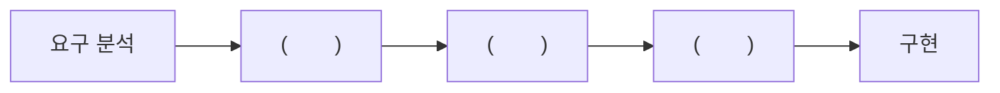

## 키워드 찾기 130문제 정리

---

1. 시제품을 끊임없이 제작하며 사이클을 반복하는 개발 방법론으로, 워터폴과 대조적이며, 소프트웨어 개발을 넘어 기업 경영 전반에서 사용되고 있다. 고객의 변화하는 요구사항과 환경 변화에 능동적인 이 소프트웨어 개발 방법론을 쓰시오.

	

	
<ins>답 확인하기</ins>

	애자일 (Agile)

	

2. 소프트웨어 공학에서 리팩토링(Refactoring)을 하는 목적에 대해 간략히 서술하시오.

	

	
<ins>답 확인하기</ins>

	리팩토링의 목적은 프로그램을 쉽게 이해하고 수정하여 빠르게 개발할 수 있도록 하기 위함이다.

	

3. 요구사항 확인에 대한 다음 설명에서 괄호(①, ②)에 들어갈 알맞은 용어를 쓰시오.

	

	- (①) 요구사항은 시스템이 무엇을 하는지, 어떤 기능을 하는지 등 사용자가 시스템을 통해 제공 받기를 원하는 기능이나 시스템이 반드시 수행해야 하는 기능을 의미한다.
	- (②) 요구사항은 품질이나 제약사항과 관련된 요구사항으로, 시스템의 장비 구성, 성능, 인터페이스, 테스트, 보안 등의 요구사항을 말한다.

	

	

	
<ins>답 확인하기</ins>

	① 기능

	② 비기능

	

4. UML(Unified Modeling Language)에 관한 다음 설명에서 괄호에 공통으로 들어갈 알맞은 용어를 쓰시오.

	

	() 다이어그램은 UML 다이어그램 중 객체(Object)들을 ()로 추상화하여 표현하는 다이어그램으로 대표적인 구조적 다이어그램이다. ()는 각각의 객체들이 갖는 속성과 메소드를 표현한 것으로 3개의 구획으로 나눠, 이름, 속성, 메소드를 표기한다.

	

	

	
<ins>답 확인하기</ins>

	클래스 (Class)

	

5. UML에 대한 다음 설명에서 괄호(① ~ ③)에 들어갈 알맞은 용어를 쓰시오.

	

	UML은 시스템 분석, 설계, 구현 등 시스템 개발 과정에서 시스템 개발자와 고객 또는 개발자 상호 간의 의사사통이 원할하게 이루어지도록 표준화한 대표적인 객체지향 모델링 언어로, 사물, (①), 다이어그램으로 이루어져있다.

	- (①)는 사물과 사물 사이의 연관성을 표현하는 것으로, 연관, 집합, 포함, 일반화 등 다양한 형태의 (①)가 존재한다.
	- (②)는 UML에 표현되는 사물의 하나로, 객체가 갖는 속성과 동작을 표현한다. 일반적으로 직사각형으로 표현하며, 직사각형 안에 이름, 속성, 동작을 표기한다.
	- (③)는 (②)와 같은 UML에 표현되는 사물의 하나로, (②)나 컴포넌트의 동작을 모아 놓은 것이며, 외부적으로 가시화되는 행동을 표현한다. 단독으로 사용되는 경우는 없으며, (③) 구현을 위한 (②) 또는 컴포넌트와 함께 사용된다.

	

	

	
<ins>답 확인하기</ins>

	① 관계 (Relationship)

	② 클래스 (Class)

	③ 인터페이스 (Interface)

	

6. UML의 관계(Relationships)에 관한 다음 설명에서 각 번호(①, ②)에 들어갈 알맞는 용어를 <보기>에서 찾아 쓰시오.

	

	관계(Relationships)는 사물과 사물 사이의 연관성을 표현한 것이다.

	① - 하나의 사물이 다른 사물에 포함되어 있는 관계로, 전체와 부분으로 구분되어지며 서로 독립적이다.

	② - 상위 모듈이 하위 모듈보다 더 일반적인 개념을 가지고 있으며, 하위 모듈이 상위 모듈보다 더 구체적인 개념을 가진다.

	

	

	보기

	- Association
	- Aggregation
	- Composition
	- Generalization
	- Dependency
	- Realization

	

	

	
<ins>답 확인하기</ins>

	① Aggregation

	② Generalization

	

7. UML을 이용한 다이어그램 중 다음 그림에 해당하는 다이어그램을 쓰시오.

	

	

	
<ins>답 확인하기</ins>

	패키지 다이어그램 (Package Diagram)

	

8. LOC 기법에 의하여 예측된 총 라인 수가 30,000라인, 개발에 참여할 프로그래머가 5명, 프로그래머들의 평균 생산성이 월간 300라인일 때, 개발에 소요되는 기간을 계산식과 함께 쓰시오.

	

	
<ins>답 확인하기</ins>

	계산식: (30,000 / 300) / 5 = 20

	답: 20개월

	

	LOC 기법에서 개발 기간은 **노력(인월) / 투입 인원**이고, 노력(인월)은 **LOC(총 라인 수) / 1인당 월 평균 생산 코드 라인 수**이므로 **(LOC / 1인당 월평균 생산 코드 라인 수) / 투입 인원**에 값을 대입하여 답을 구할 수 있음

	

	

9. 데이터베이스의 스키마(Schema)에 대해 간략히 서술하시오.

	

	
<ins>답 확인하기</ins>

	스키마는 데이터베이스의 구조와 제약 조건에 관한 전반적인 명세를 기술한 것이다.

	

10. 데이터베이스 설계에 대한 다음 설명에서 괄호(① ~ ③)에 들어갈 알맞은 용어를 쓰시오.

	

	1. (①): 논리적 구조로 표현된 데이터를 디스크 등의 저장장치에 저장할 수 있는 데이터로 변환하는 과정으로, 파일의 저장 구조 및 액세스 경로를 결정하며, 테이블 정의서 및 명세서가 산출된다.
	2. (②): 현실 세계에 대한 인식을 추상적 개념으로 표현하는 과정으로, 개념 스키마 모델링과 트랜잭션 모델링을 수행하며, 요구 조건 명세를 E-R 다이어그램으로 작성한다.
	3. (②): 현실의 자료를 특정 DBMS가 지원하는 자료구조로 변환하는 과정으로, 트랜잭션의 인터페이스를 설계하고, 정규화를 통해 스키마를 평가 및 정제한다.

	

	

	
<ins>답 확인하기</ins>

	① 물리적 설계

	② 개념적 설계

	② 논리적 설계

	

11. 다음은 데이터베이스 구축까지의 과정을 나열한 것이다. 괄호에 들어갈 알맞은 용어를 쓰시오.

	





	

	

	
<ins>답 확인하기</ins>

	개념적 설계, 논리적 설계, 물리적 설계

	

12. 데이터 모델의 구성 요소에 대한 다음 설명에서 괄호(①, ②)에 들어갈 알맞은 용어를 쓰시오.

	

	1. (①)은 데이터베이스에 저장된 실제 데이터를 처리하는 작업에 대한 명세로서 데이터베이스를 조작하는 기본 도구에 해당한다.
	2. (②)는 논리적으로 표현된 객체 타입들 간의 관계로서 데이터의 구성 및 정적 성질을 표현한다.
	3. 제약 조건은 데이터베이스에 저장될 수 있는 실제 데이터의 논리적인 제약 조건을 의미한다.

	

	

	
<ins>답 확인하기</ins>

	① 연산 (Operation)

	② 구조 (Structure)

	

13. 다음 테이블에서 카디널리티(Cardinality)와 디그리(Degree)를 구하시오.

	회원

	| ID       | 이름  | 거주지  | 신청강의 |
	| -------- | --- | ---- | ---- |
	| 191-SR05 | 백영헌 | 마포구  | E01  |
	| 024-RU09 | 차수인 | 관악구  | S03  |
	| 181-SQ03 | 허채빈 | 서대문구 | E02  |
	| 059-RL08 | 윤지호 | 광진구  | S03  |
	| 029-SX07 | 배서희 | 서대문구 | E02  |

	

	
<ins>답 확인하기</ins>

	카디널리티 (Cardinality): 5

	디그리 (Degree): 4

	

14. 다음 E-R 다이어그램을 참고하여 괄호(① ~ ⑤)의 설명에 적합한 요소를 찾아 기호(㉠ ~ ㉤)

	

	

	- (①): 관계 집합을 의미한다.
	- (②): 관계 집합과 속성을 연결한다.
	- (②): 개체 집합을 의미하며, 키로 사용되는 항목에는 밑줄을 표시한다.
	- (③): 관계 집합의 속성을 의미한다.
	- (⑤): 개체 집합과 관계 집합을 연결한다.

	

	

	
<ins>답 확인하기</ins>

	① - ㉡

	② - ㉢

	③ - ㉠

	④ - ㉣

	⑤ - ㉤

	

15. 키(Key)에 대한 다음 설명에서 괄호(①, ②)에 들어갈 알맞은 용어를 쓰시오.

	

	키(Key)는 데이터베이스에서 조건에 만족하는 튜플을 찾거나 순서대로 정렬할 때 기준이 되는 속성을 말한다.

	- 슈퍼키(Super Key)는 한 릴레이션 내에 있는 속성들의 집합으로 구성된 키로, 릴레이션을 구성하는 모든 튜플에 대해 (①)을 만족한다.
	- 후보키(Candidate Key)는 릴레이션을 구성하는 속성들 중에서 튜플을 유일하게 식별하기 위해 사용되는 속성들의 부분집합으로, (①)과 (②)을 만족하는 특징이 있다.

	

	

	
<ins>답 확인하기</ins>

	① 유일성 (Unique)

	② 최소성 (Minimality)

	

