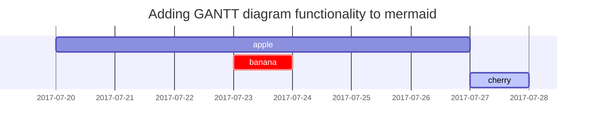

## Markdown

### Heading

```md
<!-- markdownlint-capture -->
<!-- markdownlint-disable -->

# H1 — heading

{: .mt-4 .mb-0 }

<!-- markdownlint-restore -->

## H2 — heading

{: data-toc-skip='' .mt-4 }

### H3 — heading

{: data-toc-skip='' .mt-4 }

#### H4 — heading

{: data-toc-skip='' .mt-4 }
```

### Paragraph

Quisque egestas convallis ipsum, ut sollicitudin risus tincidunt a. Maecenas interdum malesuada egestas. Duis consectetur porta risus, sit amet vulputate urna facilisis ac. Phasellus semper dui non purus ultrices sodales. Aliquam ante lorem, ornare a feugiat ac, finibus nec mauris. Vivamus ut tristique nisi. Sed vel leo vulputate, efficitur risus non, posuere mi. Nullam tincidunt bibendum rutrum. Proin commodo ornare sapien. Vivamus interdum diam sed sapien blandit, sit amet aliquam risus mattis. Nullam arcu turpis, mollis quis laoreet at, placerat id nibh. Suspendisse venenatis eros eros.

### Lists

#### Ordered list

1. Firstly
2. Secondly
3. Thirdly

```md
1. Firstly
2. Secondly
3. Thirdly
```

#### Unordered list

- Chapter
  - Section
    - Paragraph

```md
- Chapter
  - Section
    - Paragraph
```

#### ToDo list

- [ ] Job
  - [x] Step 1
  - [x] Step 2
  - [ ] Step 3

```md
- [ ] Job
  - [x] Step 1
  - [x] Step 2
  - [ ] Step 3
```

#### Description list

Sun
: the star around which the earth orbits
: the star around which the earth orbits

Moon
: the natural satellite of the earth, visible by reflected light from the sun

```md
Sun
: the star around which the earth orbits
: the star around which the earth orbits

Moon
: the natural satellite of the earth, visible by reflected light from the sun
```

### Block Quote

> This line shows the _block quote_.

```md
> This line shows the _block quote_.
```

### Prompts

{: .prompt-tip }

> An example showing the `tip` type prompt.

{: .prompt-info }

> An example showing the `info` type prompt.

{: .prompt-warning }

> An example showing the `warning` type prompt.

{: .prompt-danger }

> An example showing the `danger` type prompt.

```md
{: .prompt-tip }

> An example showing the `tip` type prompt.

{: .prompt-info }

> An example showing the `info` type prompt.

{: .prompt-warning }

> An example showing the `warning` type prompt.

{: .prompt-danger }

> An example showing the `danger` type prompt.
```

### Tables

| Company                      |     Contact      | Country |
| :--------------------------- | :--------------: | ------: |
| Alfreds Futterkiste          |   Maria Anders   | Germany |
| Island Trading               |  Helen Bennett   |      UK |
| Magazzini Alimentari Riuniti | Giovanni Rovelli |   Italy |

```md
| Company                      |     Contact      | Country |
| :--------------------------- | :--------------: | ------: |
| Alfreds Futterkiste          |   Maria Anders   | Germany |
| Island Trading               |  Helen Bennett   |      UK |
| Magazzini Alimentari Riuniti | Giovanni Rovelli |   Italy |
```

### Links

<http://127.0.0.1:4000>

```md
<http://127.0.0.1:4000>
```

### Footnote

Click the hook will locate the footnote[^footnote], and here is another footnote[^fn-nth-2].

```md
Click the hook will locate the footnote[^footnote], and here is another footnote[^fn-nth-2].
```

### Inline code

This is an example of `Inline Code`.

```md
This is an example of `Inline Code`.
```

### Filepath

Here is the `/path/to/the/file.extend`{: .filepath}.

```md
Here is the `/path/to/the/file.extend`{: .filepath}.
```

### Code blocks

#### Common

```text
This is a common code snippet, without syntax highlight and line number.
```

````md
```text
This is a common code snippet, without syntax highlight and line number.
```
````

#### Specific Language

```bash
if [ $? -ne 0 ]; then
  echo "The command was not successful.";
  #do the needful / exit
fi;
```

````md
```bash
if [ $? -ne 0 ]; then
  echo "The command was not successful.";
  #do the needful / exit
fi;
```
````

#### Specific filename

{: file='\_sass/jekyll-theme-chirpy.scss'}

```sass
@import
  "colors/light-typography",
  "colors/dark-typography";
```

````md
{: file='\_sass/jekyll-theme-chirpy.scss'}

```sass
@import
  "colors/light-typography",
  "colors/dark-typography";
```
````

### Mathematics

The mathematics powered by [**MathJax**](https://www.mathjax.org/):

$$
\begin{equation}
  \sum_{n=1}^\infty 1/n^2 = \frac{\pi^2}{6}
  \label{eq:series}
\end{equation}
$$

We can reference the equation as \eqref{eq:series}.

When $a \ne 0$, there are two solutions to $ax^2 + bx + c = 0$ and they are

$$ x = {-b \pm \sqrt{b^2-4ac} \over 2a} $$

```md
$$
\begin{equation}
  \sum_{n=1}^\infty 1/n^2 = \frac{\pi^2}{6}
  \label{eq:series}
\end{equation}
$$

We can reference the equation as \eqref{eq:series}.

When $a \ne 0$, there are two solutions to $ax^2 + bx + c = 0$ and they are

$$ x = {-b \pm \sqrt{b^2-4ac} \over 2a} $$
```

### Mermaid SVG



````md

````

[Mermaid Site][ref_site_1]

### Images

#### Default (with caption)

{: width="972" height="589" }
_Full screen width and center alignment_

```md
{: width="972" height="589" }
_Full screen width and center alignment_
```

#### Left aligned

{: width="972" height="589" .w-75 .normal}

```md
{: width="972" height="589" .w-75 .normal}
```

#### Float to left

{: width="972" height="589" .w-50 .left}
Praesent maximus aliquam sapien. Sed vel neque in dolor pulvinar auctor. Maecenas pharetra, sem sit amet interdum posuere, tellus lacus eleifend magna, ac lobortis felis ipsum id sapien. Proin ornare rutrum metus, ac convallis diam volutpat sit amet. Phasellus volutpat, elit sit amet tincidunt mollis, felis mi scelerisque mauris, ut facilisis leo magna accumsan sapien. In rutrum vehicula nisl eget tempor. Nullam maximus ullamcorper libero non maximus. Integer ultricies velit id convallis varius. Praesent eu nisl eu urna finibus ultrices id nec ex. Mauris ac mattis quam. Fusce aliquam est nec sapien bibendum, vitae malesuada ligula condimentum.

```md
{: width="972" height="589" .w-50 .left}
Praesent maximus aliquam sapien. Sed vel neque in dolor pulvinar auctor. Maecenas pharetra, sem sit amet interdum posuere, tellus lacus eleifend magna, ac lobortis felis ipsum id sapien. Proin ornare rutrum metus, ac convallis diam volutpat sit amet. Phasellus volutpat, elit sit amet tincidunt mollis, felis mi scelerisque mauris, ut facilisis leo magna accumsan sapien. In rutrum vehicula nisl eget tempor. Nullam maximus ullamcorper libero non maximus. Integer ultricies velit id convallis varius. Praesent eu nisl eu urna finibus ultrices id nec ex. Mauris ac mattis quam. Fusce aliquam est nec sapien bibendum, vitae malesuada ligula condimentum.
```

#### Float to right

{: width="972" height="589" .w-50 .right}
Praesent maximus aliquam sapien. Sed vel neque in dolor pulvinar auctor. Maecenas pharetra, sem sit amet interdum posuere, tellus lacus eleifend magna, ac lobortis felis ipsum id sapien. Proin ornare rutrum metus, ac convallis diam volutpat sit amet. Phasellus volutpat, elit sit amet tincidunt mollis, felis mi scelerisque mauris, ut facilisis leo magna accumsan sapien. In rutrum vehicula nisl eget tempor. Nullam maximus ullamcorper libero non maximus. Integer ultricies velit id convallis varius. Praesent eu nisl eu urna finibus ultrices id nec ex. Mauris ac mattis quam. Fusce aliquam est nec sapien bibendum, vitae malesuada ligula condimentum.

```md
{: width="972" height="589" .w-50 .right}
Praesent maximus aliquam sapien. Sed vel neque in dolor pulvinar auctor. Maecenas pharetra, sem sit amet interdum posuere, tellus lacus eleifend magna, ac lobortis felis ipsum id sapien. Proin ornare rutrum metus, ac convallis diam volutpat sit amet. Phasellus volutpat, elit sit amet tincidunt mollis, felis mi scelerisque mauris, ut facilisis leo magna accumsan sapien. In rutrum vehicula nisl eget tempor. Nullam maximus ullamcorper libero non maximus. Integer ultricies velit id convallis varius. Praesent eu nisl eu urna finibus ultrices id nec ex. Mauris ac mattis quam. Fusce aliquam est nec sapien bibendum, vitae malesuada ligula condimentum.
```

#### Dark/Light mode & Shadow

The image below will toggle dark/light mode based on theme preference, notice it has shadows.

{: .light .w-75 .shadow .rounded-10 w='1212' h='668' }
{: .dark .w-75 .shadow .rounded-10 w='1212' h='668' }

```md
{: .light .w-75 .shadow .rounded-10 w='1212' h='668' }
{: .dark .w-75 .shadow .rounded-10 w='1212' h='668' }
```

### Video



```md

```

### PDF Preview

<embed
  src="/assets/img/other/plan/devops.pdf#toolbar=0&navpanes=0&scrollbar=0"
  type="application/pdf"
  frameBorder="0"
  scrolling="auto"
  height="1000px"
  width="100%"
/>

```html
<embed
  src="/assets/img/other/plan/devops.pdf#toolbar=0&navpanes=0&scrollbar=0"
  type="application/pdf"
  frameBorder="0"
  scrolling="auto"
  height="1000px"
  width="100%"
/>
```

### Details

<details>
<summary markdown="span">접기/펼치기</summary>

**Markdown** Here

</details>

```md
<details>
<summary markdown="span">접기/펼치기</summary>

**Markdown** Here

</details>
```

### Reverse Footnote

[^footnote]: The footnote source
[^fn-nth-2]: The 2nd footnote source

```md
[^footnote]: The footnote source
[^fn-nth-2]: The 2nd footnote source
```

## LaTex

### 왼쪽 정렬 (기본)

$ x + y = 1 $

$x$는 $y$와의 합이 $1$이다.

```md
$ x + y = 1 $

$x$는 $y$와의 합이 $1$이다.
```

### 가운데 정렬

$$ x + y = 1$$

```md
$$ x + y = 1$$
```

### 특정 문자 기준으로 정렬

$$
\begin{aligned}
f(x)&=ax^2+bx+c\\
g(x)&=Ax^4
\end{aligned}
$$

```md
$$
\begin{aligned}
f(x)&=ax^2+bx+c\\
g(x)&=Ax^4
\end{aligned}
$$
```

### 사칙 연산

$ 1 + 1 = 2 $

$ 2 - 1 = 1 $

$ 2 \times 2 = 4 $

$ 4 \div 2 = 2 $

```md
$ 1 + 1 = 2 $

$ 2 - 1 = 1 $

$ 2 \times 2 = 4 $

$ 4 \div 2 = 2 $
```

### 분수

#### 기본형

$ \frac{1}{2} $

```md
$ \frac{1}{2} $
```

#### 특수형

$ ^1/\_2 $

```md
$ ^1/\_2 $
```

### 수학 공식, 수식 번호

$$ X _{1,j} \mathbf{F}X _{2,j} = 0, \tag{1} $$

```md
$$ X _{1,j} \mathbf{F}X _{2,j} = 0, \tag{1} $$
```

### 괄호

$ (1 + 2) $

$ \lbrace1 + 2\rbrace $

$ [1 + 2] $

```md
<!-- 소괄호 -->

$ (1 + 2) $

<!-- 중괄호 -->

$ \lbrace1 + 2\rbrace $

<!-- 대괄호 -->

$ [1 + 2] $
```

#### 괄호 리사이즈

$ \left( \frac{2}{3} \right) $

$ \Bigg( \bigg( \Big( \big( ( ) \big) \Big) \bigg) \Bigg) $

```md
<!-- 자동 리사이즈 -->

$ \left( \frac{2}{3} \right) $

<!-- 수동 리사이즈 -->

$ \Bigg( \bigg( \Big( \big( ( ) \big) \Big) \bigg) \Bigg) $
```

### 위첨자 지수 / Power

$ 2^2 = 4 $

```md
$ 2^2 = 4 $
```

### 아래첨자 지수 / Indices

$ a_1, \ a_2, \ a_3 $

```md
$ a_1, \ a_2, \ a_3 $
```

### Dots

$ \dots $

$ \cdots $

$ \vdots $

$ \ddots $

```md
<!-- 아래 -->

$ \dots $

<!-- 가운데 -->

$ \cdots $

<!-- 세로 -->

$ \vdots $

<!-- 대각선 -->

$ \ddots $
```

### 루트 (거듭제곱근) / Root

$ \sqrt{2} $

```md
$ \sqrt{2} $
```

### 집합 / Set

$ \lbrace a,b,c\rbrace \cup \lbrace d,e\rbrace = \lbrace a,b,c,d,e\rbrace $

$ \lbrace a,b,c\rbrace \cap \lbrace a,b,d\rbrace = \lbrace a,b\rbrace $

$ \emptyset $

$ x \in [-1,1] $

```md
<!-- 합집합 -->

$ \lbrace a,b,c\rbrace \cup \lbrace d,e\rbrace = \lbrace a,b,c,d,e\rbrace $

<!-- 교집합 -->

$ \lbrace a,b,c\rbrace \cap \lbrace a,b,d\rbrace = \lbrace a,b\rbrace $

<!-- 공집합 -->

$ \emptyset $

<!-- 포함 -->

$ x \in [-1,1] $
```

### 삼각함수 (싸인, 코싸인, 탄젠트, 세타)

$ \cos (2\theta) = \cos^2 \theta - \sin^2 \theta $

```md
$ \cos (2\theta) = \cos^2 \theta - \sin^2 \theta $
```

### 파이 / Pi

$ \pi $

$ \Pi $

$ \phi $

```md
$ \pi $

$ \Pi $

$ \phi $
```

### 각도

$ 90^\circ $

```md
$ 90^\circ $
```

### 로그

$ \log_b a $

```md
$\log_b a$
```

### 기타 기호 정리

#### 특수 문자

| 이름   | 명령어     | 반환       |     | 이름     | 명령어     | 반환       |
| ------ | ---------- | ---------- | --- | -------- | ---------- | ---------- |
| 알파   | `\alpha`   | $\alpha$   |     | 크사이   | `\xi`      | $\xi$      |
| 베타   | `\beta`    | $\beta$    |     | 오미크론 | `o`        | $o$        |
| 감마   | `\gamma`   | $\gamma$   |     | 파이     | `\pi`      | $\pi$      |
| 델타   | `\delta`   | $\delta$   |     | 로       | `\rho`     | $\rho$     |
| 엡실론 | `\epsilon` | $\epsilon$ |     | 시그마   | `\sigma`   | $\sigma$   |
| 제타   | `\zeta`    | $\zeta$    |     | 타우     | `\tau`     | $\tau$     |
| 에타   | `\eta`     | $\eta$     |     | 입실론   | `\upsilon` | $\upsilon$ |
| 세타   | `\theta`   | $\theta$   |     | 파이     | `\phi`     | $\phi$     |
| 이오타 | `\iota`    | $\iota$    |     | 카이     | `\chi`     | $\chi$     |
| 카파   | `\kappa`   | $\kappa$   |     | 오메가   | `\omega`   | $\omega$   |
| 람다   | `\lambda`  | $\lambda$  |     | 뉴       | `\nu`      | $\nu$      |
| 뮤     | `\mu`      | $\mu$      |     |          |            |            |

#### 관계 연산자

| 이름        | 명령어    | 반환      |     | 이름        | 명령어    | 반환      |
| ----------- | --------- | --------- | --- | ----------- | --------- | --------- |
| 합동        | `\equiv`  | $\equiv$  |     | 근사        | `\approx` | $\approx$ |
| 비례        | `\propto` | $\propto$ |     | 같고 근사   | `\simeq`  | $\simeq$  |
| 닮음        | `\sim`    | $\sim$    |     | 같지 않음   | `\neq`    | $\neq$    |
| 작거나 같음 | `\leq`    | $\leq$    |     | 크거나 같음 | `\geq`    | $\geq$    |
| 매우 작음   | `\ll`     | $\ll$     |     | 매우 큼     | `\gg`     | $\gg$     |

#### 논리 기호

| 이름           | 명령어            | 반환              |     | 이름             | 명령어        | 반환         |
| -------------- | ----------------- | ----------------- | --- | ---------------- | ------------- | ------------ |
| 불릿           | `\bullet`         | $\bullet$         |     | 부정             | `\neq`        | $\neq$       |
| wedge          | `\wedge`          | $\wedge$          |     | vee              | `\vee`        | $\vee$       |
| 논리 합        | `\oplus`          | $\oplus$          |     | 어떤             | `\exists`     | $\exists$    |
| 오른쪽 화살표  | `\rightarrow`     | $\rightarrow$     |     | 왼쪽 화살표      | `\leftarrow`  | $\leftarrow$ |
| 왼쪽 큰 화살표 | `\Leftarrow`      | $\Leftarrow$      |     | 오른쪽 큰 화살표 | `\Rightarrow` | $\gg$        |
| 양쪽 큰 화살표 | `\Leftrightarrow` | $\Leftrightarrow$ |     | 양쪽 화살표      | `\leftarrow`  | $\leftarrow$ |
| 모든           | `\forall`         | $\forall$         |     |                  |               |              |

#### 집합 기호

| 이름          | 명령어        | 반환          |     | 이름       | 명령어                     | 반환                       |
| ------------- | ------------- | ------------- | --- | ---------- | -------------------------- | -------------------------- |
| 교집합        | `\cap`        | $\cap$        |     | 합집합     | `\cup`                     | $\cup$                     |
| 상위집합      | `\supset`     | $\supset$     |     | 진상위집합 | `\supseteq`                | $\supseteq$                |
| 하위집합      | `\subset`     | $\subset$     |     | 진하위집합 | `\subseteq`                | $\subseteq$                |
| 부분집합 아님 | `\not\subset` | $\not\subset$ |     | 공집합     | `\emptyset`, `\varnothing` | $\emptyset$, $\varnothing$ |
| 원소          | `\in`         | $\in$         |     | 원소 아님  | `\notin`                   | $\notin$                   |

#### 기타

| 이름          | 명령어        | 반환          |     | 이름         | 명령어          | 반환            |
| ------------- | ------------- | ------------- | --- | ------------ | --------------- | --------------- |
| hat           | `\hat{x}`     | $\hat{x}$     |     | widehat      | `\widehat{x}`   | $\widehat{x}$   |
| 물결          | `\tilde{x}`   | $\tilde{x}$   |     | wide물결     | `\widetilde{x}` | $\widetilde{x}$ |
| bar           | `\bar{x}`     | $\bar{x}$     |     | overline     | `\overline{x}`  | $\overline{x}$  |
| check         | `\check{x}`   | $\check{x}$   |     | acute        | `\acute{x}`     | $\acute{x}$     |
| grave         | `\grave{x}`   | $\grave{x}$   |     | dot          | `\dot{x}`       | $\dot{x}$       |
| ddot          | `\ddot{x}`    | $\ddot{x}$    |     | breve        | `\breve{x}`     | $\breve{x}$     |
| vec           | `\vec{x}`     | $\vec{x}$     |     | 델, 나블라   | `\nabla`        | $\nabla$        |
| 수직          | `\perp`       | $\perp$       |     | 평행         | `\parallel`     | $\parallel$     |
| 부분집합 아님 | `\not\subset` | $\not\subset$ |     | 공집합       | `\emptyset`     | $\emptyset$     |
| 가운데 점     | `\cdot`       | $\cdot$       |     | ...          | `\dots`         | $\dots$         |
| 가운데 점들   | `\cdots`      | $\cdots$      |     | 세로 점들    | `\vdots`        | $\vdots$        |
| 나누기        | `\div`        | $\div$        |     | 물결표       | `\sim`          | $\nu$           |
| 플마, 마플    | `\pm`, `\mp`  | $\pm$, $\mp$  |     | 겹물결표     | `\approx`       | $\nu$           |
| prime         | `\prime`      | $\prime$      |     | 무한대       | `\infty`        | $\infty$        |
| 적분          | `\int`        | $\int$        |     | 편미분       | `\partial`      | $\partial$      |
| 한 칸 띄어    | `x \, y`      | $x \, y$      |     | 두 칸 띄어   | `x \; y`        | $x \; y$        |
| 네 칸 띄어    | `x \quad y`   | $x \quad y$   |     | 여덟 칸 띄어 | `x \qquad y`    | $x \qquad y$    |

## 참고 사이트

> [jekyll-theme-chirpy GitHub](https://github.com/cotes2020/jekyll-theme-chirpy)
>
> [따라쟁이 인공지능 블로그 - 마크다운 문법정리2\_수식](https://khw11044.github.io/blog/blog-etc/2020-12-21-markdown-tutorial2/)
>
> [위키백과:TeX 문법](https://ko.wikipedia.org/wiki/%EC%9C%84%ED%82%A4%EB%B0%B1%EA%B3%BC:TeX_%EB%AC%B8%EB%B2%95)

---

[ref_site_1]: https://mermaid.js.org/intro/syntax-reference.html
