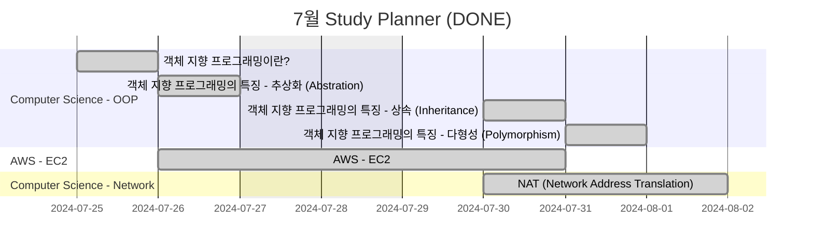

<!-- ## Gantt Diagram

<details>
<summary markdown="span">완료 사항</summary>



</details>

```mermaid
gantt
title  8월 Study Planner (ver. Rough)
excludes weekends

section Computer Science - OOP
  객체 지향 프로그래밍의 특징 - 캡슐화 (Encapsulation) :e, 2024-08-01, 1d

section Computer Science - WEB
  MVC 패턴 :f, 2024-08-02, 1d
  SSR VS CSR :g, 2024-08-05, 1d
  브라우저 렌더링 과정 :k, 2024-08-06, 1d

section Computer Science - Network
  CORS란? :h, 2024-08-07, 1d
  HTTP? HTTPS? :i, 2024-08-08, 1d
  CIDR이란? :i, 2024-08-05, 3d
  IP 기초 개념 정리 :i, 2024-08-06, 3d
  IP 클래스란? :i, 2024-08-12, 3d
  서브넷 & 서브넷 마스크란? :i, 2024-08-14, 3d

section JavaScript - Concepts
  호이스팅(Hoisting)이란? :j, 2024-08-09, 1d
  Class 사용하기 :l, 2024-08-12, 1d
  스코프와 스코프 체인, 클로저란? :n, 2024-08-13, 1d
  실행 컨텍스트 :o, 2024-08-14, 1d

section JavaScript - React
  React의 불변성 관리 :m, 2024-08-16, 1d

section C/C++ - Pointer
  혀니C코딩 포인터 강의 :p, 2024-08-17, 1d
``` -->

## <i class="far fa-folder-open fa-fw"></i> Computer Science

### <i class="far fa-folder fa-fw"></i> Network

- [CORS란?][ref_site_10]
- [HTTP? HTTPS?][ref_site_11]
- ~~[CIDR이란?][ref_site_19]~~ → 작성 완료 (2024.08.01)
- ~~[IP 기초 개념 정리][ref_site_21]~~ → 작성 완료 (2024.08.02)
- [IP 클래스란?][ref_site_22] → 작성 완료 (2024.08.05)
- [서브넷 & 서브넷 마스크란?][ref_site_22]
- ~~[NAT (Network Address Translation)][ref_site_20]~~ → 작성 완료 (2024.07.31)

### <i class="far fa-folder fa-fw"></i> OOP

- ~~[객체 지향 프로그래밍의 4가지 특징ㅣ추상화, 상속, 다형성, 캡슐화][ref_site_12]~~ → 작성 완료 (2024.08.01)
  - ~~5개 게시글로 나눠서 포스팅 예정~~
    1. ~~객체 지향 프로그래밍이란?~~ → 작성 완료 (2024.07.25)
    - ~~추상화 (Abstration)~~
    - ~~상속 (Inheritance)~~
    - ~~다형성 (Polymorphism)~~
    - ~~캡슐화 (Encapsulation)~~
    2. ~~객체 지향 프로그래밍의 특징 - 추상화 (Abstration)~~ → 작성 완료 (2024.07.26)
    3. ~~객체 지향 프로그래밍의 특징 - 상속 (Inheritance)~~ → 작성 완료 (2024.07.30)
    4. ~~객체 지향 프로그래밍의 특징 - 다형성 (Polymorphism)~~ → 작성 완료 (2024.07.31)
    5. ~~객체 지향 프로그래밍의 특징 - 캡슐화 (Encapsulation)~~ → 작성 완료 (2024.08.01)

### <i class="far fa-folder fa-fw"></i> WEB

- [MVC 패턴][ref_site_8]
- [SSR VS CSR][ref_site_9]
- [브라우저 렌더링 과정][ref_site_3]

## <i class="far fa-folder-open fa-fw"></i> AWS

### <i class="far fa-folder fa-fw"></i> EC2

~~[말랑카우 - 초보자를 위한 AWS VPC, Subnet, EC2 개념 정리][ref_site_18]~~ → 작성 완료 (2024.07.30)

## <i class="far fa-folder-open fa-fw"></i> JavaScript

### <i class="far fa-folder fa-fw"></i> Concepts

- [호이스팅(Hoisting)이란?][ref_site_2]
- [Class 사용하기][ref_site_4]
- [스코프와 스코프 체인, 클로저란?][ref_site_6]
- [실행 컨텍스트][ref_site_7]

### <i class="far fa-folder fa-fw"></i> React

- [React의 불변성 관리][ref_site_5]

### <i class="far fa-folder fa-fw"></i> ECMAScript

- [ECMAScript 시리즈][ref_site_13]
  - 시간날 때 수시로 업데이트 예정
    - ~~[ES2015(ES6) const, let][es_page_1]~~ → 작성 완료 (2024.07.25)

## <i class="far fa-folder-open fa-fw"></i> C/C++

### <i class="far fa-folder fa-fw"></i> Pointer

- [혀니C코딩 포인터 강의][ref_site_1]

## <i class="far fa-folder-open fa-fw"></i> 공부 로드맵

### <i class="far fa-folder fa-fw"></i> Frontend

[Frontend Roadmap][ref_site_14]

<details>
<summary markdown="span">접기/펼치기</summary>

<embed
  src="{{page.image-path}}/frontend.pdf#toolbar=0&navpanes=0&scrollbar=0"
  type="application/pdf"
  frameBorder="0"
  scrolling="auto"
  height="1000px"
  width="100%"
/>

</details>

### <i class="far fa-folder fa-fw"></i> Backend

[Backend Roadmap][ref_site_15]

<details>
<summary markdown="span">접기/펼치기</summary>

<embed
  src="{{page.image-path}}/backend.pdf#toolbar=0&navpanes=0&scrollbar=0"
  type="application/pdf"
  frameBorder="0"
  scrolling="auto"
  height="1000px"
  width="100%"
/>

</details>

### <i class="far fa-folder fa-fw"></i> DevOps

[DevOps Roadmap][ref_site_16]

<details>
<summary markdown="span">접기/펼치기</summary>

<embed
  src="{{page.image-path}}/devops.pdf#toolbar=0&navpanes=0&scrollbar=0"
  type="application/pdf"
  frameBorder="0"
  scrolling="auto"
  height="1000px"
  width="100%"
/>

</details>

### <i class="far fa-folder fa-fw"></i> 사이트

[Developer Roadmaps][ref_site_17]

<!-- 이미지 -->

[plan_nothing]: {{page.image-path}}/plan_nothing.png
[frontend]: {{page.image-path}}/frontend.pdf
[backend]: {{page.image-path}}/backend.pdf
[devops]: {{page.image-path}}/devops.pdf

<!-- 블로그 게시글 -->

[es_page_1]: {{site.url}}/posts/es-const-let/

<!-- 참고 사이트 -->

[ref_site_1]: https://m.youtube.com/watch?v=bz63_WWtKc4
[ref_site_2]: https://velog.io/@hyungjin_han/JavaScript-%ED%98%B8%EC%9D%B4%EC%8A%A4%ED%8C%85Hoisting%EC%9D%B4%EB%9E%80
[ref_site_3]: https://velog.io/@hyungjin_han/JavaScript-%EB%B8%8C%EB%9D%BC%EC%9A%B0%EC%A0%80-%EB%A0%8C%EB%8D%94%EB%A7%81-%EA%B3%BC%EC%A0%95
[ref_site_4]: https://velog.io/@hyungjin_han/JavaScript-Class-%EC%82%AC%EC%9A%A9%ED%95%98%EA%B8%B0
[ref_site_5]: https://velog.io/@hyungjin_han/JavaScript-React%EC%9D%98-%EB%B6%88%EB%B3%80%EC%84%B1-%EA%B4%80%EB%A6%AC
[ref_site_6]: https://velog.io/@hyungjin_han/JavaScript-%EC%8A%A4%EC%BD%94%ED%94%84%EC%99%80-%EC%8A%A4%EC%BD%94%ED%94%84%EC%B2%B4%EC%9D%B8-%ED%81%B4%EB%A1%9C%EC%A0%80%EB%9E%80
[ref_site_7]: https://velog.io/@hyungjin_han/JavaScript-%EC%8B%A4%ED%96%89-%EC%BB%A8%ED%85%8D%EC%8A%A4%ED%8A%B8
[ref_site_8]: https://velog.io/@hyungjin_han/MVC-%ED%8C%A8%ED%84%B4
[ref_site_9]: https://velog.io/@hyungjin_han/Computer-Science-SSR-VS-CSR
[ref_site_10]: https://velog.io/@hyungjin_han/Computer-Science-CORS%EB%9E%80
[ref_site_11]: https://velog.io/@hyungjin_han/Computer-Science-HTTP-HTTPS
[ref_site_12]: https://www.codestates.com/blog/content/%EA%B0%9D%EC%B2%B4-%EC%A7%80%ED%96%A5-%ED%94%84%EB%A1%9C%EA%B7%B8%EB%9E%98%EB%B0%8D-%ED%8A%B9%EC%A7%95
[ref_site_13]: https://www.zerocho.com/category/ECMAScript?page=3
[ref_site_14]: https://roadmap.sh/frontend
[ref_site_15]: https://roadmap.sh/backend
[ref_site_16]: https://roadmap.sh/devops
[ref_site_17]: https://roadmap.sh/
[ref_site_18]: https://malangcow.medium.com/%EC%B4%88%EB%B3%B4%EC%9E%90%EB%A5%BC-%EC%9C%84%ED%95%9C-aws-vpc-subnet-ec2-%EA%B0%9C%EB%85%90-%EC%A0%95%EB%A6%AC-b96e103abf71
[ref_site_19]: https://kim-dragon.tistory.com/9
[ref_site_20]: https://kim-dragon.tistory.com/9
[ref_site_21]: https://inpa.tistory.com/entry/WEB-%F0%9F%8C%90-IP-%EA%B8%B0%EC%B4%88-%EC%82%AC%EC%84%A4IP-%EA%B3%B5%EC%9D%B8IP-NAT-%EA%B0%9C%EB%85%90-%EC%A0%95%EB%A7%90-%EC%89%BD%EA%B2%8C-%EC%A0%95%EB%A6%AC
[ref_site_22]: https://inpa.tistory.com/entry/WEB-IP-%ED%81%B4%EB%9E%98%EC%8A%A4-%EC%84%9C%EB%B8%8C%EB%84%B7-%EB%A7%88%EC%8A%A4%ED%81%AC-%EC%84%9C%EB%B8%8C%EB%84%B7%ED%8C%85-%EC%B4%9D%EC%A0%95%EB%A6%AC
