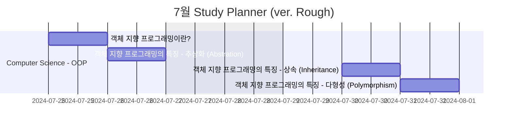
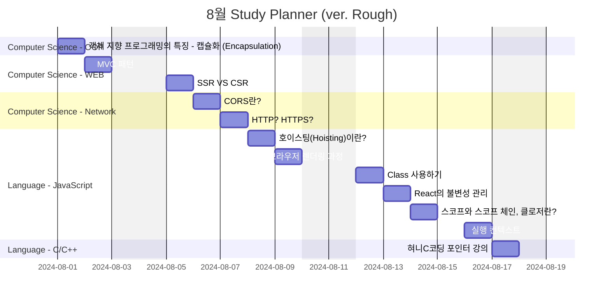

## Gantt Diagram

## Computer Science

### Network

- [CORS란?][ref_site_10]
- [HTTP? HTTPS?][ref_site_11]

### OOP

- [객체 지향 프로그래밍의 4가지 특징ㅣ추상화, 상속, 다형성, 캡슐화][ref_site_12]
  - 5개 게시글로 나눠서 포스팅 예정
    1. 객체 지향 프로그래밍이란?
    - 추상화 (Abstration)
    - 상속 (Inheritance)
    - 다형성 (Polymorphism)
    - 캡슐화 (Encapsulation)
    2. 객체 지향 프로그래밍의 특징 - 추상화 (Abstration)
    3. 객체 지향 프로그래밍의 특징 - 상속 (Inheritance)
    4. 객체 지향 프로그래밍의 특징 - 다형성 (Polymorphism)
    5. 객체 지향 프로그래밍의 특징 - 캡슐화 (Encapsulation)

### WEB

- [MVC 패턴][ref_site_8]
- [SSR VS CSR][ref_site_9]

## Language

### JavaScript

- [호이스팅(Hoisting)이란?][ref_site_2]
- [브라우저 렌더링 과정][ref_site_3]
- [Class 사용하기][ref_site_4]
- [React의 불변성 관리][ref_site_5]
- [스코프와 스코프 체인, 클로저란?][ref_site_6]
- [실행 컨텍스트][ref_site_7]

### C/C++

- [혀니C코딩 포인터 강의][ref_site_1]

<!-- 이미지 -->

[image_1]: {{page.image-path}}/plan_nothing.png

<!-- 블로그 게시글 -->

[heap_page]: {{site.url}}/posts/heap/

<!-- 참고 사이트 -->

[ref_site_1]: https://m.youtube.com/watch?v=bz63_WWtKc4
[ref_site_2]: https://velog.io/@hyungjin_han/JavaScript-%ED%98%B8%EC%9D%B4%EC%8A%A4%ED%8C%85Hoisting%EC%9D%B4%EB%9E%80
[ref_site_3]: https://velog.io/@hyungjin_han/JavaScript-%EB%B8%8C%EB%9D%BC%EC%9A%B0%EC%A0%80-%EB%A0%8C%EB%8D%94%EB%A7%81-%EA%B3%BC%EC%A0%95
[ref_site_4]: https://velog.io/@hyungjin_han/JavaScript-Class-%EC%82%AC%EC%9A%A9%ED%95%98%EA%B8%B0
[ref_site_5]: https://velog.io/@hyungjin_han/JavaScript-React%EC%9D%98-%EB%B6%88%EB%B3%80%EC%84%B1-%EA%B4%80%EB%A6%AC
[ref_site_6]: https://velog.io/@hyungjin_han/JavaScript-%EC%8A%A4%EC%BD%94%ED%94%84%EC%99%80-%EC%8A%A4%EC%BD%94%ED%94%84%EC%B2%B4%EC%9D%B8-%ED%81%B4%EB%A1%9C%EC%A0%80%EB%9E%80
[ref_site_7]: https://velog.io/@hyungjin_han/JavaScript-%EC%8B%A4%ED%96%89-%EC%BB%A8%ED%85%8D%EC%8A%A4%ED%8A%B8
[ref_site_8]: https://velog.io/@hyungjin_han/MVC-%ED%8C%A8%ED%84%B4
[ref_site_9]: https://velog.io/@hyungjin_han/Computer-Science-SSR-VS-CSR
[ref_site_10]: https://velog.io/@hyungjin_han/Computer-Science-CORS%EB%9E%80
[ref_site_11]: https://velog.io/@hyungjin_han/Computer-Science-HTTP-HTTPS
[ref_site_12]: https://www.codestates.com/blog/content/%EA%B0%9D%EC%B2%B4-%EC%A7%80%ED%96%A5-%ED%94%84%EB%A1%9C%EA%B7%B8%EB%9E%98%EB%B0%8D-%ED%8A%B9%EC%A7%95
